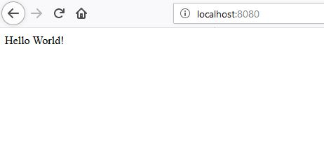

# Step-01 : Hello World

## Outils de développement

Pour faire du java, vous pouvez utiliser [Intellij de JetBrains](https://www.jetbrains.com/idea/) ou bien installer le [pack d'extensions Java pour VS Code](https://code.visualstudio.com/docs/java/extensions).

## Initialisation du projet avec Maven

Pour générer la structure du projet Jooby nous allons utiliser Maven, un gestionnaire de dépendance et de construction pour Java (une sorte d'équivalent à NPM).  
Deux choix sont possibles :  

* Vous avez déjà Maven d'installé ? `mvn -version` vous retourne les infos d'instalation de Maven.  
=> dans ce cas vous pouvez lancer la commande suivante dans votre répertoire `workspace` :   
`mvn archetype:generate -B -DgroupId=fr.enib.cai -DartifactId=jooby-beers -Dversion=1.0-SNAPSHOT -DarchetypeArtifactId=jooby-archetype -DarchetypeGroupId=org.jooby -DarchetypeVersion=1.5.1`  

* Vous n'avez pas Maven d'installé, vous pouvez utiliser le maven wrapper fournis dans le répertoire `workspace` :  
`./mvnw archetype:generate -B -DgroupId=fr.enib.cai -DartifactId=jooby-beers -Dversion=1.0-SNAPSHOT -DarchetypeArtifactId=jooby-archetype -DarchetypeGroupId=org.jooby -DarchetypeVersion=1.5.1`  

Pour utiliser correctement le Maven Wrapper, pensez à remplir correctement le fichier `worspace\.mvn\jvm.config` pour y mettre les information du proxy notament.

Le fichier `pom.xml` est l'équivalent du ficher `package.json`, c'est ce dernier qui explique comment l'application est construite et qui liste les différentes dépendences utilisées par notre projet.  

## Créer une API Hello World minimale  

Par défaut, l'archetype génère une application Jooby ayant déjà une API d'Hello World ;)  

Votre application Jooby est articulée autour de la classe `App.Java`, cette classe étends la classe `Jooby.java`.
```Java
public class App extends Jooby { ... }
```  
Cette classe doit avoir un main qui execute l'application : 
```Java
  public static void main(final String[] args) {
    run(App::new, args);
  }
```
Le reste du code de notre application va prendre place dans ce qu'on appele un **bloc d'initialisation d'instance** (Instance Initialization Block (IIB)).
L'IIB contient du code qui sera toujours éxecuté à chaque fois qu'une instance sera créée et cela avant le constructeur de l'instance.
```Java
  {
    get("/", () -> "Hello World!");
  }
```

## Lançons notre application
Pour démarer le serveur, il suffit de lancer la commande : 
`mvnw jooby:run`  
ou si vous utilisez le maven wrapper : 
`mvnw jooby:run`

Dans la console vous devriez voir si tout va bien :  
```shell
[2018-11-25 15:26:38,505]-[Hotswap] INFO  fr.enib.cai.App - [dev@netty]: Server started in 1167ms

  GET /    [*/*]     [*/*]    (/anonymous)

listening on:
  http://localhost:8080/
```
Si vous allez à l'adresse [localhost:8080](http://localhost:8080) vous verrez : 
